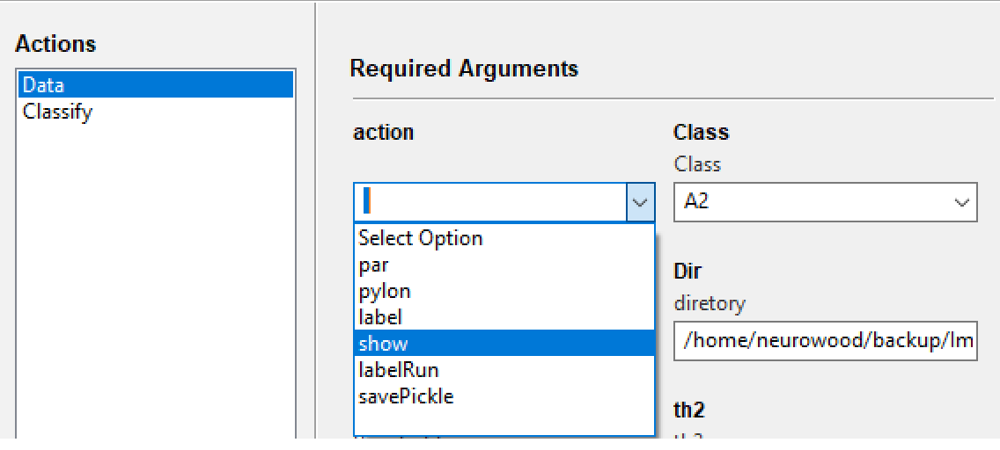
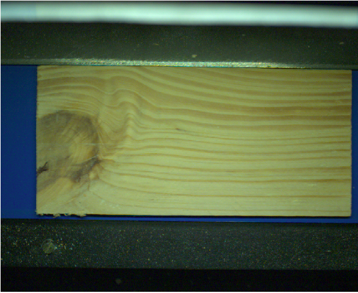

-----------
# NeuroWood
-----------
NeuroWood é um software para classificação de qualidade da madeira, voltado à soluções para a indústria madeireira e moveleira. Utiliza técnicas de aprendizado de máquina e visão computacional para classificar imagens do fluxo de processos na madeira em tempo real, permitindo tomada de decisão rápida e automática.

## Instalação

### Pré-Requisitos

#### Python 3

Certifique-se de que o Python versão 3 ou superior está disponível no sistema:
```
python3 --version
```
Se necessário, utilize o gerenciador de pacotes do seu sistema operacional ou obtenha a versão do Python mais recente em <https://www.python.org/downloads/>

#### Bibliotecas Python

Utilize o pip para instalar as dependências:
```
sudo python3 -m pip install numpy scipy sklearn scikit-image
sudo python3 -m pip install https://extras.wxpython.org/wxPython4/extras/linux/gtk3/ubuntu-16.04/wxPython-4.0.0b1-cp36-cp36m-linux_x86_64.whl phoenix gooey
```
Pode ser necessário instalar dependências para o módulo wxPython. Elas podem ser verificadas [aqui](https://github.com/wxWidgets/Phoenix/blob/master/README.rst#prerequisites)

Serão utilizadas seguintes bibliotecas python:

*  numpy 
*  PIL import Image 
*  cv2 
*  pypylon.pylon as py 
*  pickle 
*  h5py 
*  time as tm 
*  os 
*  glob 
*  matplotlib.pyplot as plt 
*  PIL import Image  
*  keras.models import load_model 
*  logging 
*  sys 
*  snap7 
*  snap7 import util 
*  from scipy import signal 
*  from keras import layers 

## Setup

### Câmera

A interface entre o *hardware* da câmera Basler ([acA1300-200uc](https://github.com/caffonso/NW/blob/main/Files/acA1300-200uc_Datasheet.pdf)) e a sistema de visão será realizado através do app ```pypylon```.
Para instalação windows:
```
pip3 install pypylon
```
Maiores informações sobre os requisitos, setups e instalção do app pode ser obtidas através do link: https://github.com/basler/pypylon
O esquema de iluminação utiliza duas lampadas  ([ISO8.1](https://github.com/caffonso/NW/blob/main/Files/ISO-8-1.pdf)) de 8".
O acesso ao app **pypylon**, deve ser feito através do prompt através da método ```OpenPylon()```:

```
    def OpenPylon():
      os.system("/opt/pylon5/bin/./PylonViewerApp")
```

Os parâmetros da câmera deve ser ajustado no app neurowood acessando ``<data><action><pylon>``
    


 Aparecera a tela do app da camera onde deve ajustar:
*  Exposure ( default = 800 )
    
### Capitura das imagem

#### Imagens estáticas

Incialmente deve-se ajustar as imagens estáticas, possicionando uma amostra de peca diretamente 
abaixo da câmera e ajustar os recortes através do método ```OpenImage()```. 



Os disturbios devem ser verificados eliminados, a fim de garantir a
uma boa captação de imagens:

* *over light*
* sugidades ou corpos estranhos
* imagem fora de foco

 


### Imagens dinâmicas

Nesta etápa são ajustadas as imagens em condição de operação portanto, deve-se certificar que a esteira de movimentaçõ deve estar operando
em velocidade de produção. 
Acionar o metodoo ``` Enhancement```, conforme ilustração a seguir:


Os parâmetros a seguir devem ser acessados até que o recorte da imagem esteja adquado:
* rx
* ry
* xc
* yc


A fim de ajuste as pecas devem ser liberadas manualmente e em pequena quantidade, até que a captura das imagens
esteja totalmente ajustada, conforme imagem abaixo.

 


        minX,minY = corner(im0,args,channel)
        showEnhance(im0,args,minX,minY)  

    
 As estremidades das pecas são encontradas atraves do método ```corner()```.
    

    def corner(im0,args,channel):
      rx,ry,r0y,yc,xc,edge     = args.rx,args.ry,args.r0y,args.yc,args.xc,args.edge   
      my,mx,Max                = 0,0,0 
      minY,minX                = args.r0y,0

      for i in range(0,rx):
        mx = (im0[yc,i,channel]-im0[yc,i+1,channel])**2
        if mx >= Max:
          Max  = mx
          minX0 = i
      minX0 = minX0+edge

      my,mx,Max                = 0,0,0
      for i in range(r0y,ry):
        my = (im0[i,xc,channel]-im0[i+1,xc,channel])**2
        if my>= Max:
          Max = my
          minY1     = i
      minY1 = minY1 + edge     

      minY = minY1 
      minX = minX0  

      return minX,minY
 
Os parâmetros a seguir devem ser acessados até que o recorte da imagem esteja adquado:
* rx
* ry
* xc
* yc 
    
    
### Resolução de problemas.
    
| problema     | ação  | 
| :---:        | :---: | 
| *over light*                  | Ajustar *Exposure* da camerâ através do método `pylon`.         |
|sugidades ou corpos estranhos  | Limpar área utilizando um pano seco                           |    
|imagem fora de foco            | Ajuste manual do foco nas lentes                              |

